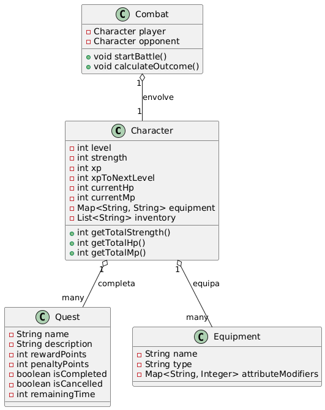
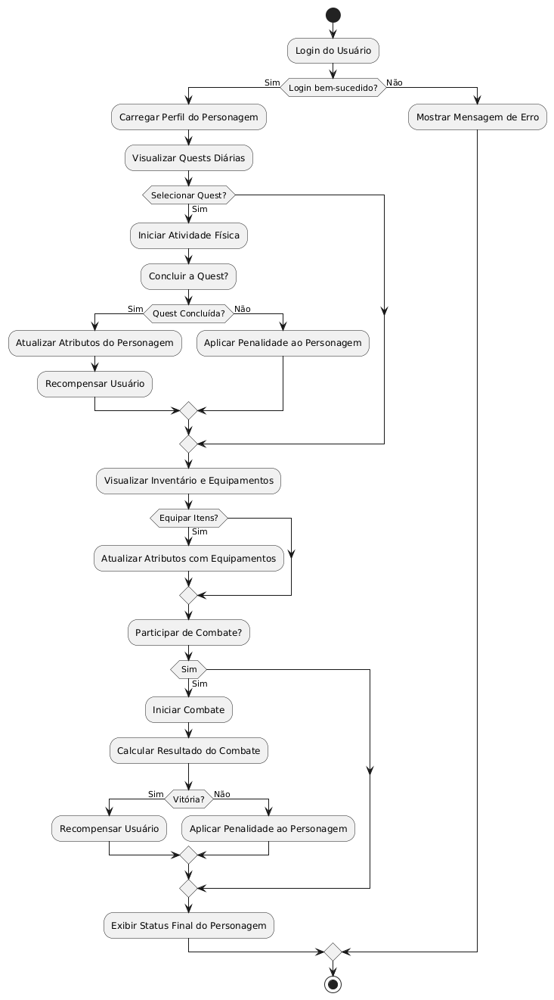

# QuestYourself

**Projeto de Gamificação para Atividade Física**

Aplicativo desenvolvido por **Bruno Buzzi**

Email: bruno.buzzi@catolicasc.edu.br  
Instituição: **Católica de Santa Catarina**  
Curso: **Engenharia de Software**  
Disciplina: **T2ESOFT08N | Portfólio de Projeto**

---

## 💡 **Motivação**

Muitas pessoas têm dificuldade em manter uma rotina de exercícios físicos. Gamificar os exercícios transforma essa rotina em uma experiência divertida e recompensadora. Utilizando elementos de RPG, os usuários se sentem motivados a completar "quests" e evoluir seus personagens.

---

## 📚 **Escopo**

O QuestYourself é um aplicativo de gamificação para atividades físicas. Ele utiliza elementos de RPG para motivar os usuários a se exercitarem de forma divertida e recompensadora.

### **Objetivo**
- Estimular o usuário a realizar atividades físicas diárias utilizando gamificação.
- Transformar a rotina de exercícios em uma experiência divertida e envolvente.

### **Funcionalidades Principais**
- Atribuição de quests diárias.
- Sistema de progressão de níveis e atributos.
- Sistema de equipamentos que afetam os atributos do personagem.
- Punição automática por não completar quests.
- Sistema de combate para testar os atributos do personagem.

---

## 📊 **Requisitos Funcionais (RF)**

### **Autenticação**
- **RF 001**: O usuário pode se cadastrar com e-mail e senha.
- **RF 002**: O usuário pode realizar login com e-mail e senha.

### **Gerenciamento de Personagem**
- **RF 003**: Visualizar perfil do personagem, incluindo atributos e equipamentos equipados.

### **Sistema de Quests**
- **RF 004**: Visualizar uma lista de quests diárias.
- **RF 005**: Concluir quests e atualizar atributos automaticamente.
- **RF 006**: Visualizar status das quests e recompensas.

### **Punições e Recompensas**
- **RF 007**: Penalização por não completar quests.
- **RF 008**: Recompensas ao atingir metas de exercícios.

### **Equipamentos**
- **RF 009**: Equipar itens que afetam os atributos do personagem.
- **RF 010**: Os equipamentos afetam os atributos do personagem visivelmente.

### **Sistema de Combate**
- **RF 011**: Participar de combates que escalam com os atributos.
- **RF 012**: Gerar recompensas/punições com base no resultado do combate.

---

## 🌐 **Requisitos Não Funcionais (RNF)**

- **RNF 001**: Suporte ao crescimento contínuo de usuários.
- **RNF 002**: Banco de dados escalável.
- **RNF 003**: Autenticação forte para segurança.
- **RNF 004**: Interface intuitiva (principais ações em até 3 toques).
- **RNF 005**: Design responsivo para diferentes dispositivos.
- **RNF 006**: Tempo de resposta inferior a 5 segundos.

---

## 🛠️ **Tecnologias Aplicadas**

### **Linguagens e Frameworks**
- Dart (Flutter)

### **Banco de Dados**
- Firebase Firestore

### **Ferramentas**
- Flutter SDK
- Firebase Authentication
- Git
- Visual Studio Code

### **Bibliotecas**
- Provider
- FontAwesome (para ícones personalizados)
- cloud_firestore (integração com Firestore)
- firebase_auth (autenticação)
- flutter_test (testes unitários)
- intl (formatação de datas e números)
- dart:async (operações assíncronas)
- dart:math (geração de recompensas aleatórias)

---

## 🔄 **Metodologia**

- **Metodologia**: Kanban
- **Ferramenta de Gerenciamento**: Trello
- **Práticas de Desenvolvimento**:
  - Entregas incrementais
  - Sprints semanais
  - Desenvolvimento Orientado a Testes (TDD)

---

## 🎨 **Estrutura de Dados**

### **Classes Principais**

#### `Character`
```dart
class Character {
  int level;
  int strength;
  int xp;
  int xpToNextLevel;
  int currentHp;
  int currentMp;
  Map<String, String?> equipment;
  List<String> inventory;

  Character({
    required this.level,
    required this.strength,
    required this.xp,
    required this.xpToNextLevel,
    required this.currentHp,
    required this.currentMp,
    required this.equipment,
    this.inventory = const [],
  });

  int get totalStrength => strength + _getEquipmentBonus('strength');
  int get totalHp => 50 + (level * 20) + _getEquipmentBonus('hp');
  int get totalMp => 20 + (level * 10) + _getEquipmentBonus('mp');
}
```

#### `Quest`
```dart
class Quest {
  final String name;
  final String description;
  final int rewardPoints;
  final int penaltyPoints;
  bool isCompleted;
  bool isCancelled;
  int remainingTime;

  Quest({
    required this.name,
    required this.description,
    required this.rewardPoints,
    required this.penaltyPoints,
    this.isCompleted = false,
    this.isCancelled = false,
    this.remainingTime = 300,
  });
}
```

---

## 📁 **Organização do Repositório**

```
lib/
│-- main.dart
│
├── models/
│   └── character.dart
│
├── providers/
│   ├── character_provider.dart
│   ├── combat_provider.dart
│   └── quest_provider.dart
│
├── screens/
│   ├── combat_screen.dart
│   ├── login_screen.dart
│   ├── profile_screen.dart
│   ├── quest_screen.dart
│   └── register_screen.dart
│
└── services/
    └── auth_service.dart
```

---

## 📊 **Diagrama de Classes**



---

## 📊 **Diagrama de Atividades**



---

## 🚀 **Trabalhos Correlatos**

### **Workout Quest - Gamified Gym**
- **Descrição**: Aplicativo que adapta rotinas de exercícios físicos com base no equipamento disponível em casa.

### **Do It Now: Tarefas RPG**
- **Descrição**: Aplicativo de lista de tarefas com elementos de RPG, incluindo habilidades, atributos e níveis para motivar o usuário a cumprir suas tarefas diárias.

---

## 🚀 **Trabalhos Futuros**

- Aprimorar o sistema de batalha.
- Implementar multiplayer.
- Adicionar gestão de mana/energia (MP).
- Melhorar a personalização dos personagens.
- Adicionar mais tipos de quests e desafios.
- Melhorar UI/UX.
- Disponibilizar o app em outras línguas.
